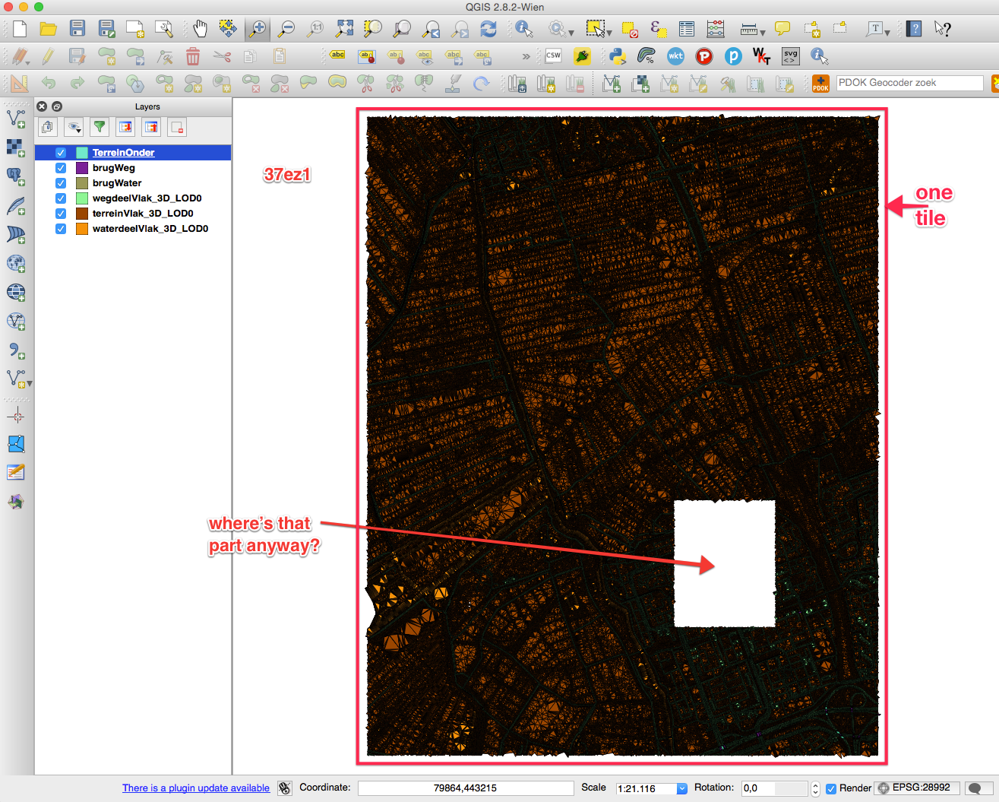

# Some preliminary comments about the validation of the 3DTOP10NL

## ALL triangles are duplicated

In the 4 tiles I've checked (`25ez1`, `37en1`, `37en21`, `37ez1`) the triangles for the class `terreinVlak_3D_LOD0` are duplicated.
Notice that I don't have ArcGIS and I am using the [OpenFileGDB](http://www.gdal.org/drv_openfilegdb.html) to read the goemetries.
But I have converted one tile to a SHP and I too get twice each triangle.

At first I thought that you had stored each triangle twice (one in each direction) for visualisation purposes, but no each triangle is there twice in the same order.
Luckily it's always one after the other, so automatic cleaning is easy. 
All my results below implies that I first jettison the duplicates.

## often big parts are missing 

eg the rectangular areas in tile `37ez1`. Why is that? Is it "normal"?

## some classes don't have polygons and/or triangles

In tile `25ez1`, no triangles/polygons fill the bridges (no features in `brugWeg` and
`brugWater`).

In tile `37en1`/`37ez1`, unlike `25ez1` have features in `brugWeg`/`terreinOnder`/`brugWater`, but
these are *not* triangulated.
Where are the triangles?

## triangulation has several long and skinny triangles

Especially in water area, there are sometimes regular patterns where (unnecessary) points in the middle of the water exist.
Also, are these Steiner points or they are left from the simplification of the AHN2 points?
I think we should aim at avoid long and skinny triangles, especially if we want to distribute in GML (or another TXT format), then the precision could become an issue for users.

## features have ITC attributes

## Vertical triangles

I count 380 of them in the tile `25ez1` for the class `terreinVlak_3D_LOD0` (out of 1,173,848). 
Will these only happen at the borders (where 2 different classes are adjacent) of polygons of top10nl?
Or can they also be in the middle of a polygon? 
I assume only for 2 different classes, and if it is so, what is the rule, to which class is the vertical triangle assigned?

## TOP10NL polygons are arbitrarily split into several features while triangulating

I can't figure out the rules, but the splitting creates unconnected parts (which we do not want I assume).
See for example these:

These could be easily fixed because the `TOP10_ID` for each feature is kept, and we could merge these.
See that the unconnected parts are actually coming from a (connected) polygon in the original TOP10NL:

## how are polygons are the border handled?

In tile `25ez1` there are these cases:

And at the border of 2 other tiles:

What is the rule to decide where to split input polygons?

## Some results

