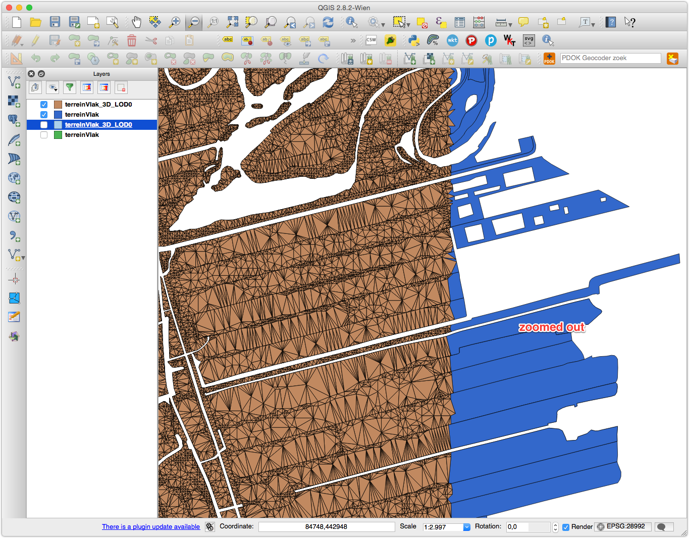

# Some comments and questions about the validation of the 3DTOP10NL datasets


## ALL triangles are duplicated

In the 4 tiles I've checked (`25ez1`, `37en1`, `37en21`, `37ez1`) the triangles for the class `terreinVlak_3D_LOD0` are duplicated.
Notice that I don't have ArcGIS and I am using the [OpenFileGDB](http://www.gdal.org/drv_openfilegdb.html) to read the geometries.
But I have converted one tile to a SHP and I too get twice each triangle.

At first I thought that you had stored each triangle twice (one in each direction) for visualisation purposes, but no each triangle is there twice in the same order.
Luckily it's always one after the other, so automatic cleaning is easy. 
All my results below implies that I first jettison the duplicates.


## often big parts of tiles are missing 

eg the rectangular areas in tiles `37ez1` and `37en1` (observe that this is not the whole tile, only a rectangular part of one).
Why is that? Is it "normal"?


## some classes don't have polygons and/or triangles

In tile `25ez1`, no triangles/polygons fill the bridges (no features in `brugWeg` and
`brugWater`).

In tile `37en1`/`37ez1`, unlike `25ez1` have features in `brugWeg`/`terreinOnder`/`brugWater`, but
these are *not* triangulated.
Where are the triangles?


## triangulation has several long and skinny triangles

Especially in water area, there are sometimes regular patterns where (unnecessary) points in the middle of the water exist.
Also, are these Steiner points or they are left from the simplification of the AHN2 points?
I think we should aim at avoid long and skinny triangles, especially if we want to distribute in GML (or another TXT format), then the precision could become an issue for users.


## features have ITC attributes


## Vertical triangles have often the wrong orientation

I count 380 of them in the tile `25ez1` for the class `terreinVlak_3D_LOD0` (out of 1,173,848). 
Will these only happen at the borders (where 2 different classes are adjacent) of polygons of top10nl?
Or can they also be in the middle of a polygon? 
I assume only for 2 different classes, and if it is so, what is the rule, to which class is the vertical triangle assigned?

These vertical are the source of a lot of problems since their orientation is often not consistent with the other triangles.
See for instance that simple example (tile `25ez1`, `waterdeelVlak_3D_LOD0`, `117116312`), where we see 5 triangles.
In the GDB there 14 triangles since 2 are vertical (and we don't see them) and they are all duplicated.


The orientation of the vertical ones is not consistent with the 5 others (orientation is either Clockwise (CW) or Counterclockwise (CCW)) and that's makes it impossible to construct a topological structure from them.

I first thought that all vertical triangles were wrongly oriented, so I tried to swap the vertical ones.
That worked for some cases, but not for all and also created more problems at other places.
If there is a logic for the orientation of the vertical triangles, then please tell me I could fix them.
If not, then it's also possible to fix, but a bit more involved it is.
I haven't double-check everything, but it seems that if there is a wrong triangulation for a region, this region has always one or more vertical triangles.

## TOP10NL polygons are arbitrarily split into several features while triangulating

I can't figure out the rules, but the splitting creates unconnected parts (which we do not want I assume).
See for example these:


These could be easily fixed because the `TOP10_ID` for each feature is kept, and we could merge these.
See that the unconnected parts are actually coming from a (connected) polygon in the original TOP10NL:


## how are polygons are the border handled?

In tile `25ez1` there are these cases:


And at the border of 2 other tiles:




And another one for the `waterdeelVlak_3D_LOD0`:


What is the rule to decide where to split input polygons?


## ALL the buildings are geometrically invalid

I've tried 3 tiles, and *zero* building is valid.
The good news is that they all have exactly *one* error: all their faces have the wrong orientation (normals are pointing inwards).
All the rest is okay; thus easy to solve.
That could be an [OpenFileGDB](http://www.gdal.org/drv_openfilegdb.html) issue though, ie perhaps the reader flips all the polygons (but I doubt it, to be checked in ArcGIS).


## Some numbers

For the tile `37ez1.gdb`:

```
Input file /Users/hugo/data/3dtop10nl/37ez1.gdb
Processing layer 'terreinVlak_3D_LOD0'
# Regions: 3,540
# triangles: 1,346,806
# invalid triangle(s): 0
# vertical triangle(s): 284
# invalid regions: 301
```

Single triangle validation means that I verify that there is indeed a triangle with 3 vertices; all valid.

8.5% of the regions are invalid, that is they are disconnected (mostly because of the splitting of the TOP10NL input polygons).

If I merge the regions based on the `TOP10_NL` I obtain less invalid regions, but there are still 89 (2.5% of the region), which are most likely on the border of the tile.

- - - 

```
Input file /Users/hugo/data/3dtop10nl/25ez1.gdb
Processing layer 'wegdeelVlak_3D_LOD0'
# MultiPolygons: 8672
# triangles: 339972
# invalid triangle(s): 0
# vertical triangle(s): 22574
# invalid regions: 691
```

These 691 are after the features with the same `TOP10_NL` have been merged, and the causes are not only disconnected parts at the boundary of the tile, but also several duplicate edges (even after duplicate triangles have been removed).

<!-- [35, 50, 54, 55, 62, 76, 82, 83, 99, 105, 139, 209, 249, 259, 265, 269, 276, 287, 307, 310, 315, 329, 330, 335, 338, 349, 352, 355, 361, 362, 369, 379, 397, 402, 410, 425, 452, 470, 501, 504, 512, 515, 526, 530, 548, 565, 581, 588, 667, 674, 687, 691, 694, 711, 720, 774, 806, 813, 840, 841, 853, 882, 888, 911, 915, 916, 934, 942, 961, 964, 965, 1006, 1022, 1027, 1045, 1055, 1057, 1060, 1080, 1081, 1082, 1089, 1092, 1100, 1104, 1116, 1122, 1127, 1144, 1155, 1156, 1160, 1165, 1180, 1189, 1201, 1213, 1228, 1239, 1240, 1241, 1245, 1250, 1263, 1268, 1273, 1297, 1304, 1317, 1322, 1338, 1341, 1365, 1373, 1382, 1397, 1433, 1441, 1449, 1450, 1456, 1462, 1470, 1482, 1483, 1495, 1500, 1504, 1506, 1507, 1520, 1525, 1539, 1565, 1568, 1569, 1577, 1579, 1582, 1586, 1599, 1608, 1615, 1637, 1641, 1642, 1645, 1659, 1673, 1681, 1685, 1701, 1716, 1717, 1719, 1731, 1733, 1751, 1752, 1756, 1760, 1766, 1772, 1775, 1807, 1851, 1873, 1893, 1906, 1912, 1916, 1917, 1920, 1923, 1950, 1952, 1961, 1967, 1969, 1972, 1996, 1997, 2003, 2011, 2022, 2042, 2059, 2063, 2080, 2100, 2105, 2110, 2141, 2144, 2148, 2246, 2287, 2296, 2309, 2315, 2321, 2360, 2365, 2374, 2406, 2410, 2412, 2420, 2425, 2439, 2447, 2456, 2465, 2470, 2478, 2483, 2503, 2519, 2521, 2587, 2599, 2622, 2659, 2662, 2675, 2677, 2678, 2681, 2683, 2734, 2753, 2771, 2773, 2784, 2791, 2805, 2809, 2837, 2843, 2844, 2847, 2850, 2851, 2855, 2859, 2901, 2909, 2915, 2919, 2946, 2954, 2963, 2970, 2982, 2990, 2993, 2995, 3000, 3004, 3023, 3044, 3051, 3055, 3058, 3081, 3089, 3103, 3117, 3120, 3121, 3128, 3132, 3170, 3214, 3216, 3226, 3235, 3246, 3277, 3281, 3286, 3297, 3313, 3317, 3329, 3343, 3361, 3363, 3364, 3372, 3380, 3388, 3398, 3407, 3421, 3425, 3442, 3463, 3484, 3489, 3492] -->

<!-- [u'107529433', u'107833143', u'107849607', u'107837358', u'125232154', u'124798131', u'107762062', u'107829933', u'107829934', u'107849129', u'125232284', u'107847385', u'107826367', u'107762532', u'107828950', u'107837119', u'107841935', u'107836401', u'107827888', u'107538120', u'107849359', u'107664917', u'107841411', u'107835621', u'107846821', u'107835057', u'107843259', u'107829824', u'107829357', u'107848095', u'125369233', u'125232185', u'125232290', u'107849707', u'107836422', u'107849642', u'107828927', u'107513062', u'107829373', u'107845705', u'107502678', u'107849715', u'107841453', u'107847115', u'125232208', u'107841987', u'107844345', u'125231993', u'125232016', u'107834412', u'107842379', u'125232331', u'107540002', u'107836904', u'107835163', u'125382268', u'125232134', u'107835343', u'107841951', u'107843310', u'107839313', u'107664921', u'107832577', u'107827905', u'107842942', u'107839498', u'107835322', u'107829447', u'107828918', u'107845270', u'107845277', u'124280359', u'107838861', u'107836672', u'125231976', u'125232470', u'125232127', u'125369320', u'107557679', u'107832545', u'107840993', u'107845317', u'107849792', u'107847352', u'107835126', u'107842699', u'107850219', u'107834822', u'107838965'] -->


